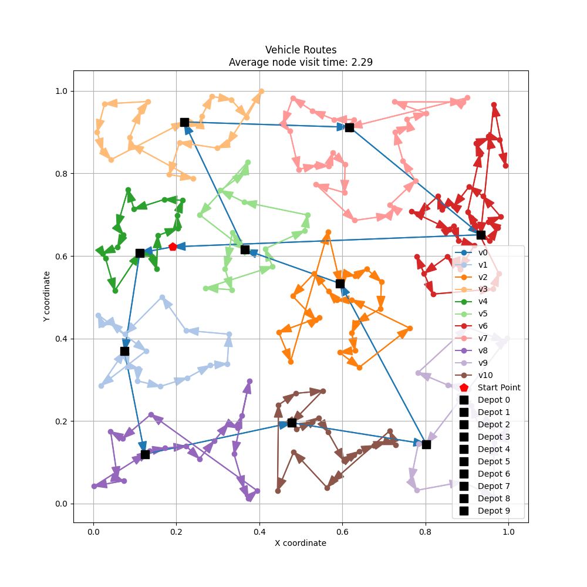
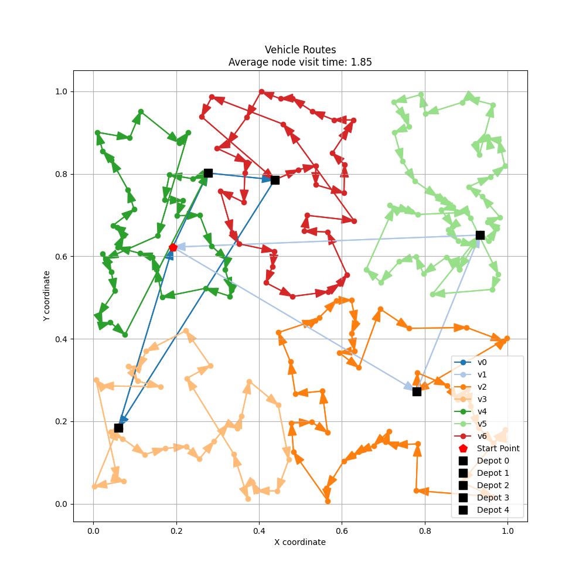
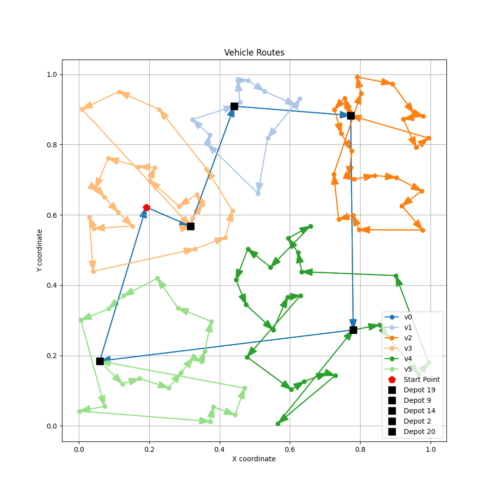
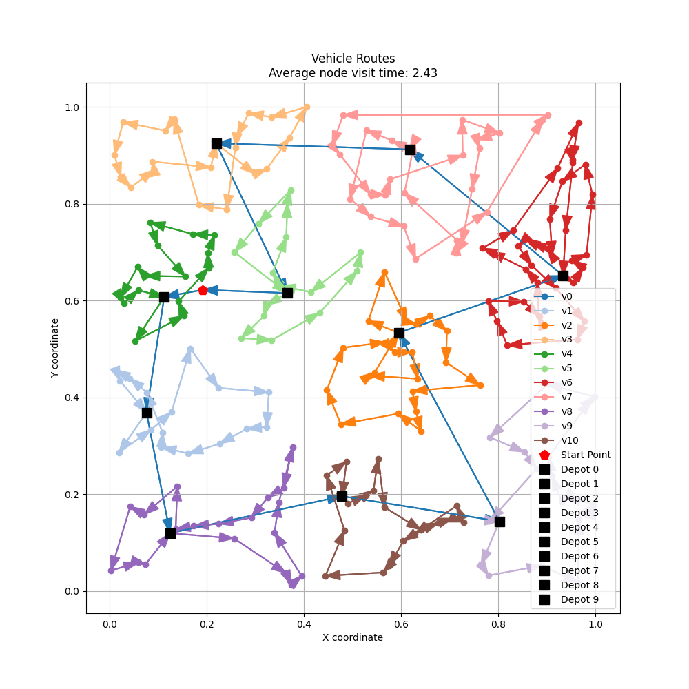
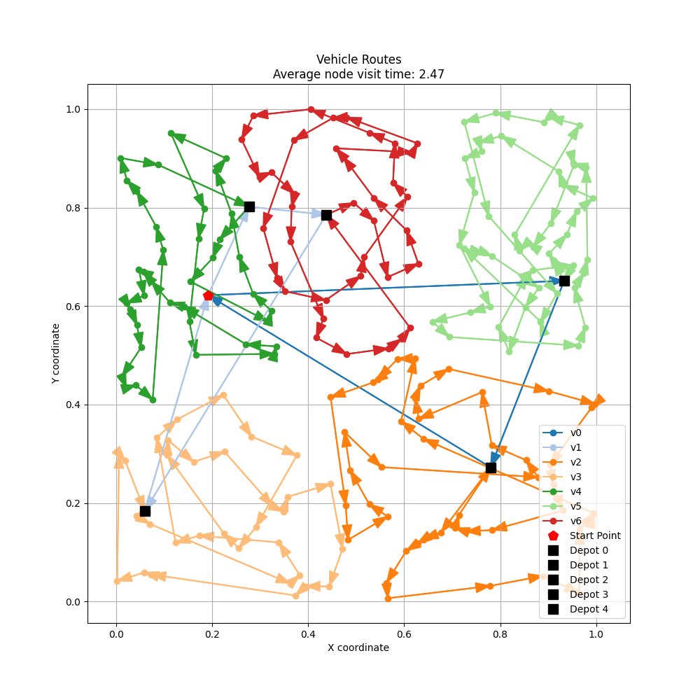
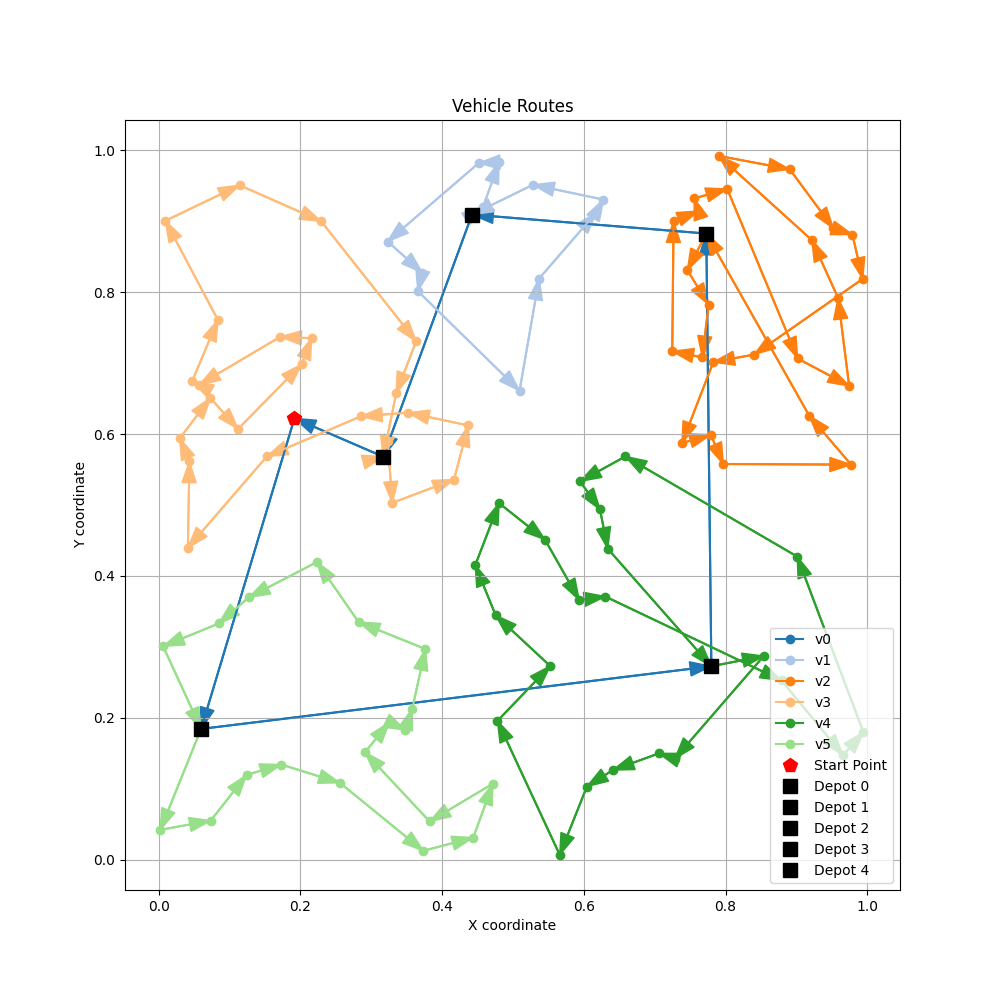
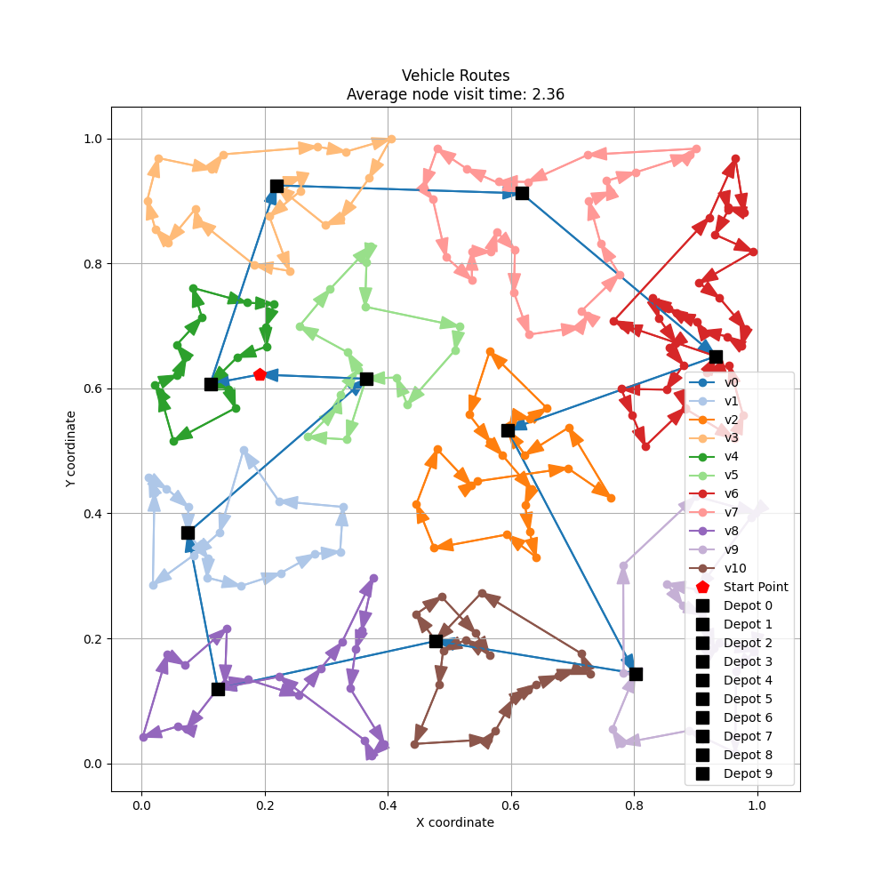
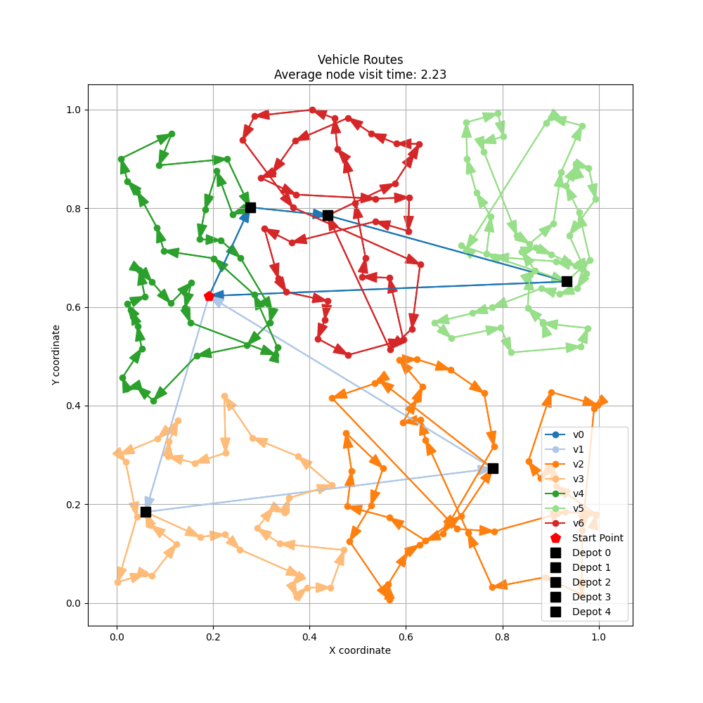
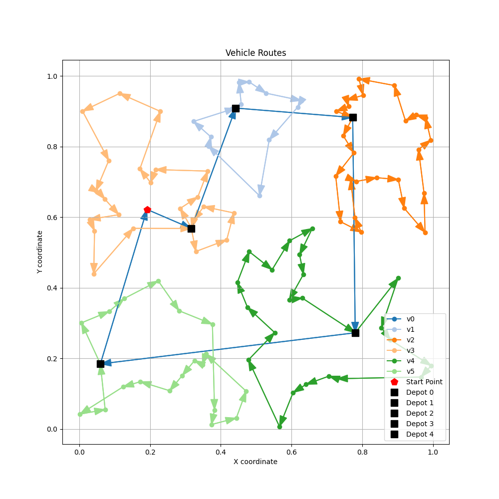

# Near Neighbour

## 结果可视化

用三种方法跑了一下三个settings下的结果，下面采用第一个sample的结果作为比较

```json
settings = {
    "setting1": {
        "n_poi": 200,
        "n_depots": 40,
        "n_UGVs": 1,
        "n_UAVs": 10,
    },
    "setting2": {
        "n_poi": 200,
        "n_depots": 20,
        "n_UGVs": 2,
        "n_UAVs": 5,
    },
    "setting3": {
        "n_poi": 100,
        "n_depots": 20,
        "n_UGVs": 1,
        "n_UAVs": 5,
    }
}
```

| method | setting1 | setting2 | setting3 |
| :----: | :------: | :------: | :------: |
| Nearest_Neighbor |  |  |  |
| Simulated_Annealing |  |  |  |
| Genetic_Algorithm |  |  |  |