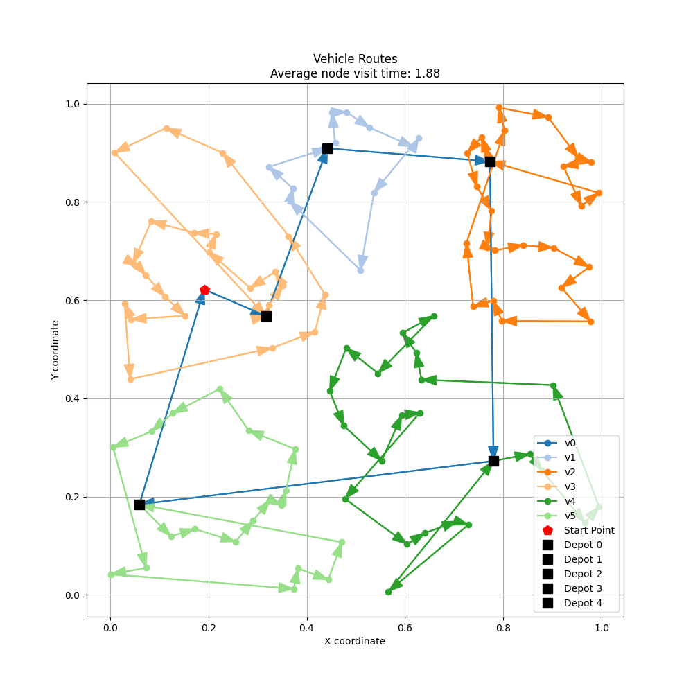

# Near Neighbour

| method | setting1 | setting2 | setting3 |
| :----: | :------: | :------: | :------: |
| Nearest_Neighbor |  |  |  |
| Simulated_Annealing |  |  |  |
| Genetic_Algorithm |  |  |  |

## 工作

- 跑了config中所有settings
- 完全按照google表格里的参数

### 实验结果

- 只用了Nearest Neighbor
- 考虑了一个bus-stop可以放飞多个无人机

| avg_time | "n_UGVs": 1,</br>"n_UAVs": 5 | "n_UGVs": 1,</br>"n_UAVs": 10 | "n_UGVs": 2,</br>"n_UAVs": 10 | "n_UGVs": 2,</br>"n_UAVs": 20 |
| -------- | ---------------------------- | ----------------------------- | ----------------------------- | ----------------------------- |
| "n_poi": 100, </br>"n_depots": 20 |  1.849  |  1.799  |   1.311   |   1.279   |
| "n_poi": 200, </br>"n_depots": 20 |  2.177  |  1.977  |   1.477   |   1.362   |
    
| avg_time | "n_depots": 10 | "n_depots": 20 | "n_depots": 30 | "n_depots": 40 |
| -------- | ---------------------------- | ----------------------------- | ----------------------------- | ----------------------------- |
| "n_poi": 100, </br>"n_UGVs": 1, </br>"n_UAVs": 10 |  1.634  |  1.797  |   1.853   |   1.881   |
| "n_poi": 200, </br>"n_UGVs": 2, </br>"n_UAVs": 20 |  1.234  |  1.359  |   1.422   |   1.460   |

- 考虑了每个bus-stop的放飞无人机数量而对UGV的路径进行权重

| avg_time | "n_UGVs": 1,</br>"n_UAVs": 5 | "n_UGVs": 1,</br>"n_UAVs": 10 | "n_UGVs": 2,</br>"n_UAVs": 10 | "n_UGVs": 2,</br>"n_UAVs": 20 |
| -------- | ---------------------------- | ----------------------------- | ----------------------------- | ----------------------------- |
| "n_poi": 100, </br>"n_depots": 20 |  1.836  |  1.783  |   1.299   |   1.265   |
| "n_poi": 200, </br>"n_depots": 20 |  2.168  |  1.965  |   1.469   |   1.351   |
    
| avg_time | "n_depots": 10 | "n_depots": 20 | "n_depots": 30 | "n_depots": 40 |
| -------- | ---------------------------- | ----------------------------- | ----------------------------- | ----------------------------- |
| "n_poi": 100, </br>"n_UGVs": 1, </br>"n_UAVs": 10 |  1.615  |  1.780  |   1.837   |   1.862   |
| "n_poi": 200, </br>"n_UGVs": 2, </br>"n_UAVs": 20 |  1.224  |  1.347  |   1.411   |   1.449   |

## Quick Start

- 如果想换不同settings来跑一下，可以更改`config.py`

```json
settings = {
    "setting1": {
        "n_poi": 200,
        "n_depots": 40,
        "n_UGVs": 1,
        "n_UAVs": 10,
    },
    "setting2": {
        "n_poi": 200,
        "n_depots": 20,
        "n_UGVs": 2,
        "n_UAVs": 5,
    },
    "setting3": {
        "n_poi": 100,
        "n_depots": 20,
        "n_UGVs": 1,
        "n_UAVs": 5,
    }
}
```

- 改完之后直接跑`demo.py`即可

```shell
python demo.py
```

- 可视化的时候在`visualize.py`更改想要可视化的settings
- 然后会自动读取对应的`.json`文件并可视化routes

```python
setting = 'setting1'
```

```shell
python visualize.py
```