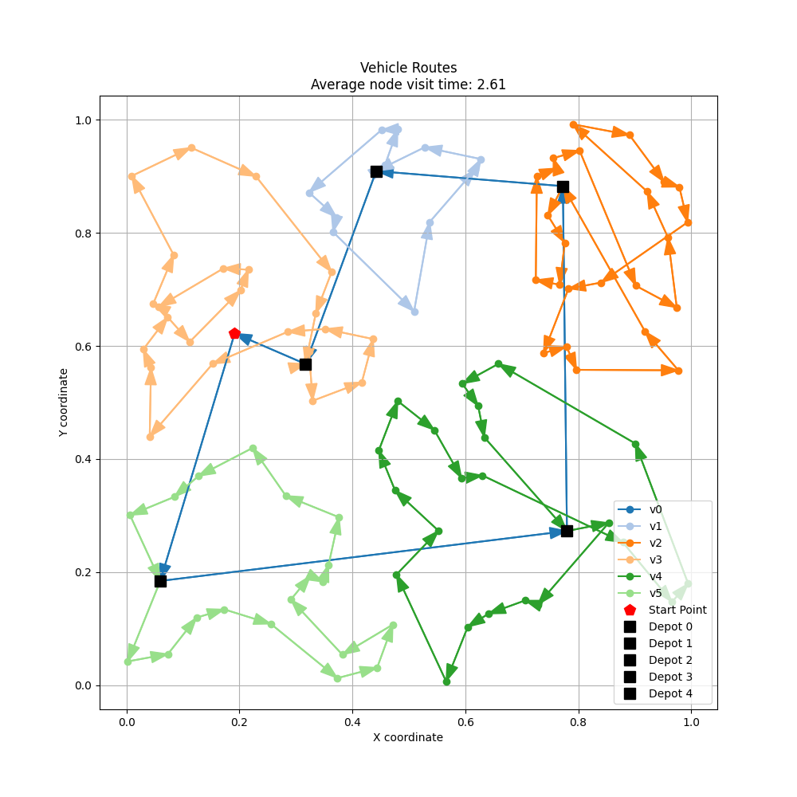

# Near Neighbour

| method | setting1 | setting2 | setting3 |
| :----: | :------: | :------: | :------: |
| Nearest_Neighbor |  |  |  |
| Simulated_Annealing |  |  |  |
| Genetic_Algorithm |  |  |  |

## 工作

- 跑了config中所有settings
- 只用了Nearest Neighbor

## Quick Start

- 如果想换不同settings来跑一下，可以更改`config.py`

```json
settings = {
    "setting1": {
        "n_poi": 200,
        "n_depots": 40,
        "n_UGVs": 1,
        "n_UAVs": 10,
    },
    "setting2": {
        "n_poi": 200,
        "n_depots": 20,
        "n_UGVs": 2,
        "n_UAVs": 5,
    },
    "setting3": {
        "n_poi": 100,
        "n_depots": 20,
        "n_UGVs": 1,
        "n_UAVs": 5,
    }
}
```

- 改完之后直接跑`demo.py`即可

```shell
python demo.py
```

- 可视化的时候在`visualize.py`更改想要可视化的settings
- 然后会自动读取对应的`.json`文件并可视化routes

```python
setting = 'setting1'
```

```shell
python visualize.py
```